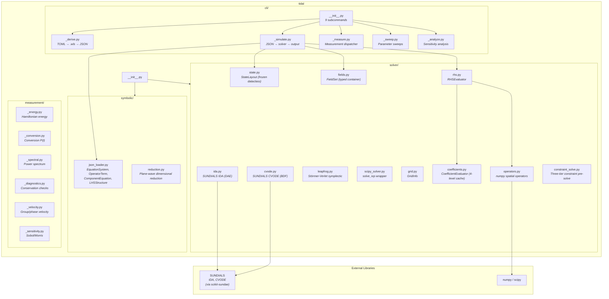
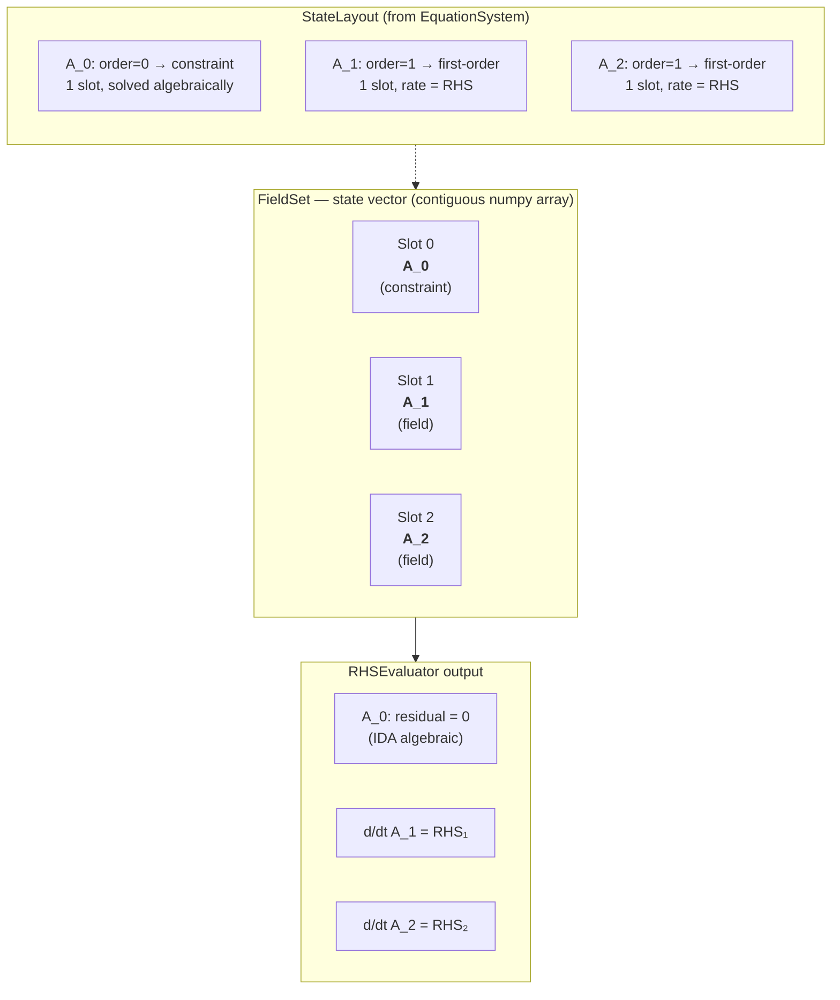
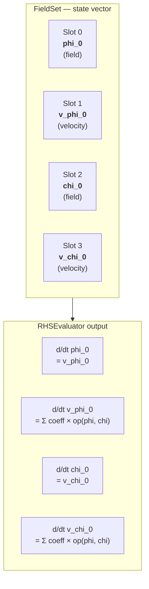
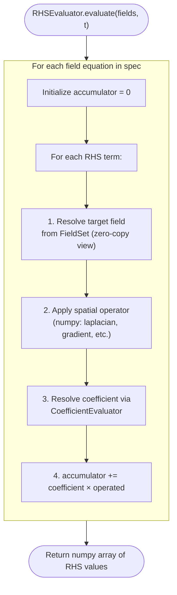

# Architecture

Visual guide to the TIDAL Lagrangian-to-PDE pipeline.
All PDEs derive from a Lagrangian via symbolic computation — no physics is hardcoded in Python.

---

## 1. Data Flow Pipeline

The pipeline has two stages separated by a JSON specification file.

**Stage 1 (Mathematica/xAct)** derives field equations symbolically from a Lagrangian.
**Stage 2 (Python/SUNDIALS + numpy)** loads the specification and runs a numerical simulation.

```mermaid
flowchart LR
    subgraph stage1["Stage 1 — Symbolic (Mathematica / xAct)"]
        L["Lagrangian<br/>L(φ, ∂φ, g)"] --> EL["EulerLagrange.wl<br/>δL/δφ = 0"]
        EL --> CD["ComponentDecompose.wl<br/>Tensor → scalar components"]
        CD --> EJ["ExportJSON.wl<br/>BuildMultiFieldJSONStructure"]
    end

    EJ --> JSON[("JSON Specification<br/>examples/data/*.json")]

    subgraph stage2["Stage 2 — Numerical (Python / SUNDIALS + numpy)"]
        JSON --> JL["json_loader.py<br/>EquationSystem"]
        JL --> SL["StateLayout + FieldSet<br/>+ GridInfo"]
        SL --> RHS["RHSEvaluator<br/>+ CoefficientEvaluator"]
        RHS --> SOLVE["Solver backend<br/>(IDA / CVODE / leapfrog / scipy)"]
        SOLVE --> OUT["Simulation results<br/>& plots"]
    end
```



### Wolfram Module Roles

| Module | Purpose | Key Export |
|--------|---------|-----------|
| `CommonUtilities.wl` | Shared helpers: CD→Derivative conversion, Christoffel/epsilon evaluation, metric components | `ConvertCDToDerivatives`, `EvaluateChristoffelComponents` |
| `EulerLagrange.wl` | Derive equations of motion from a Lagrangian | `EulerLagrangeEquation[L, field, cd]` |
| `ComponentDecompose.wl` | Convert tensor EOM to scalar component equations | `DecomposeToComponents[eom, field, chart, additionalFields]` |
| `ExportJSON.wl` | Serialize component equations to JSON | `BuildMultiFieldJSONStructure[fieldEquations, metadata]` |
| `GaugeFix.wl` | Gauge fixing presets and custom expressions | `AddGaugeFixingTerm`, `BuildLorenzGaugeTerm`, `BuildDeDonderGaugeTerm` |
| `Linearize.wl` | Perturbation theory (xPert) for linearized gravity | `LinearizeTensorExpression[expr]` |

### JSON Specification Structure

```json
{
  "spacetime": { "dimension": 3, "signature": [-1, 1, 1], "coordinates": ["t", "x", "y"] },
  "fields":    [{ "name": "phi_0", "slot_kind": "field", "time_derivative_order": 2 }],
  "equations": [{
    "field_name": "phi_0",
    "lhs": { "expression": "...", "order": { "time": 2 } },
    "rhs": [{ "coefficient": -1.0, "coefficient_symbolic": "-m2",
              "operator": "identity", "field": "phi_0",
              "time_dependent": false, "coordinate_dependent": false }]
  }],
  "hamiltonian_terms": [{ "coefficient": 0.5, "operator": "identity", "fields": ["v_phi_0", "v_phi_0"] }],
  "coupling":  { "mass_matrix": [[1.0]], "coupling_matrix": [[0.0]] },
  "metadata":  { "lagrangian": "...", "gauge": null, "linearized": false }
}
```

---

## 2. Python Module Dependencies



The `symbolic/` subpackage loads JSON specs into `EquationSystem` dataclasses.
The `solver/` subpackage provides the numerical engine: state management, spatial operators, RHS evaluation, and four time-integration backends.
The `cli/` subpackage provides the `tidal` command-line interface with 9 subcommands (derive, simulate, inspect, measure, list, validate, plot, sweep, analyze).
The `measurement/` subpackage provides 13 post-hoc analysis types (energy, conversion, mixing, spectrum, spectral_conversion, dispersion, conservation, effective_mass, asymptotic, peak_conversion, velocity, resonance, summary).

---

## 3. State Structure (StateLayout + FieldSet)

The simulation state is managed by two classes:

- **`StateLayout`** (frozen dataclass in `state.py`): maps field names to slot indices, slot kinds, and time derivative orders. Computed once from the JSON spec.
- **`FieldSet`** (typed container in `fields.py`): a contiguous flat numpy array with zero-copy named views for each field.

The layout depends on each component's **time derivative order** in the JSON specification:

| Time Order | Slots Used | Slot Kinds | Rate Computation |
|-----------|------------|------------|-----------------|
| 2 (wave-like) | field + velocity | `"field"` + `"velocity"` | d/dt field = velocity; d/dt velocity = RHS |
| 1 (first-order) | field only | `"field"` | d/dt field = RHS |
| 0 (constraint) | field only | `"constraint"` | Algebraic: solved by constraint_solve.py or IDA |

### Example: Chern-Simons (A_0 constraint, A_1 and A_2 first-order)



### Example: Coupled Scalars (two second-order fields)



Cross-field coupling: a term in the phi equation can reference `chi_0` via `{"operator": "laplacian", "field": "chi_0"}`.

Velocity naming convention: `v_{field_name}` (e.g., `v_phi_0`, `v_A_1`) — Euler-Lagrange velocity form, not canonical momenta.

---

## 4. Execution Flow: `RHSEvaluator.evaluate()`

Called by the solver backend at every timestep. Iterates over field equations and accumulates RHS terms.



### Solver Backends

Each backend calls `RHSEvaluator.evaluate()` with different integration strategies:

| Backend | Entry Point | Integration Method |
|---------|------------|-------------------|
| **IDA** | `ida.py` | Implicit Newton iteration for DAE systems. Residual form: `F(t, y, y') = 0`. Supports sparse Jacobian and analytical Jacobian (precomputed dF/dy + dF/dy'). |
| **CVODE** | `cvode.py` | BDF adaptive ODE. Tolerance-controlled (`--rtol`/`--atol`). Automatic step size selection. |
| **Leapfrog** | `leapfrog.py` | Störmer-Verlet symplectic. KDK splitting with force caching (halves force evaluations). |
| **scipy** | `scipy_solver.py` | `solve_ivp` wrapper with DOP853/Radau/BDF methods. |

Automatic solver selection: systems with algebraic constraints → IDA; pure wave equations → CVODE or leapfrog.

### Coefficient Resolution Hierarchy (4-Level Cache)

Each RHS term has a coefficient that may be constant, time-dependent, or position-dependent.
`CoefficientEvaluator` (in `coefficients.py`) resolves coefficients via a fast-path hierarchy:

```
L0: Pre-resolved constants  — computed once at __init__, stored as float
L1: Expression string cache — Mathematica→Python conversion, computed once
L2: Spatial grid arrays     — position-dependent but time-independent, computed once per grid
L3: Per-timestep dedup      — time+position dependent, deduplicated within each timestep
     ├─ Constant: parameter lookup → float
     ├─ Time-only: eval(expr, {t=t, params}) → float
     └─ Position-dependent: eval(expr, {t, x, y, z}) → ndarray (grid-shaped)
```

---

## Working Examples (27 total)

| Example | Dim | Fields | Key Features |
|---------|-----|--------|--------------|
| `scalar_field/` | 1+1D | phi_0 | Basic scalar wave, mass term |
| `electromagnetic/` | 1+1D | A_0, A_1 | Maxwell equations, Lorenz gauge |
| `proca/` | 1+1D | A_0, A_1 | Massive vector field (Proca mass) |
| `coupled_scalars/` | 1+1D | phi_0, chi_0 | Cross-field coupling, mass matrix |
| `scalar_potential_well/` | 1+1D | phi_0 | Background potential well, bound states |
| `cylindrical_kg_1d/` | 1+1D | phi_0 | Cylindrical coordinates, plane-wave 1D reduction |
| `gravitational_waves_1d/` | 1+1D | h_ij | Linearized gravity, plane-wave 1D reduction |
| `spherical_kg_1d/` | 1+1D | phi_0 | Spherical coordinates, plane-wave 1D reduction |
| `chern_simons/` | 2+1D | A_0, A_1, A_2 | Epsilon tensor, constraint equation |
| `elasticity/` | 2+1D | u_0, u_1 | Anisotropic Laplacian, cross derivatives |
| `curved_spacetime/` | 2+1D | phi_0 | De Sitter Hubble friction, time-dependent coefficients |
| `sphere_kg/` | 2+1D | phi_0 | Stereographic S², position-dependent coefficients |
| `polar_kg/` | 2+1D | phi_0 | Polar coordinates, 1/r Christoffel correction |
| `electrostatics/` | 2+1D | phi_0 | Poisson equation, constraint solver |
| `scalar_vector_coupling/` | 2+1D | phi_0, A_i | Mixed-rank cross-field (scalar+vector), 4 constants |
| `massive_gravity/` | 2+1D | h_ij | Linearized massive gravity, Fierz-Pauli, xPert |
| `coupled_proca/` | 2+1D | A_i, B_i | Two massive vectors, coupled Helmholtz constraints |
| `coupled_scattering/` | 2+1D | phi_0, chi_0 | Position-dependent Gaussian coupling, background fields |
| `proca_background/` | 2+1D | A_i, B_i | Lorentzian scalar background, constraint+BG integration |
| `vector_background/` | 2+1D | phi_0, A_i | Tanh domain wall vector background, sign-changing coupling |
| `scalar_field_3d/` | 3+1D | phi_0 | Full 4D Klein-Gordon, 32³ grid |
| `spherical_kg/` | 3+1D | phi_0 | Spherical coordinates, trig coefficients (Cot, Csc) |
| `cylindrical_kg/` | 3+1D | phi_0 | Mixed curved (r,θ) and flat (z) directions |
| `gravitational_waves/` | 3+1D | h_ij | xPert linearization, TT gauge, rank-2 tensor |
| `massive_3form/` | 3+1D | C_ijk | Rank-3 antisymmetric tensor, symmetry reduction 64→4 |

---

## Supported Operators

Operators map JSON terms to numpy spatial operations (2nd-order finite-difference stencils). All support cross-field references and periodic/Dirichlet/Neumann boundary conditions.

| Operator | Min Dim | Description |
|----------|---------|-------------|
| `identity` | 1D | Field itself (mass terms) |
| `laplacian` | 1D | Full spatial Laplacian |
| `laplacian_x`, `_y`, `_z` | 1D/2D/3D | Directional second derivative |
| `gradient_x`, `_y`, `_z` | 1D/2D/3D | Directional first derivative |
| `cross_derivative_xy`, `_xz`, `_yz` | 2D/3D | Mixed partial derivative |
| `first_derivative_t` | 1D | Time derivative (friction/damping terms) |
| `biharmonic` | 1D | Fourth-order Laplacian |
| `mixed_T_S1_S2_...` | 1D | Mixed time-space operators (auto-extracted from Wolfram) |
