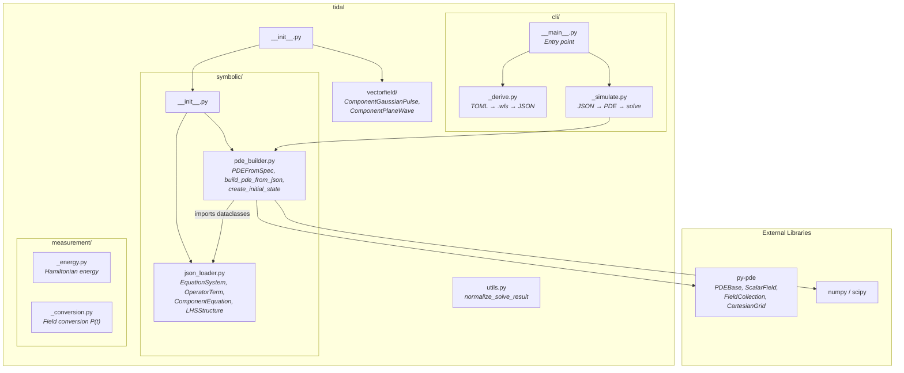
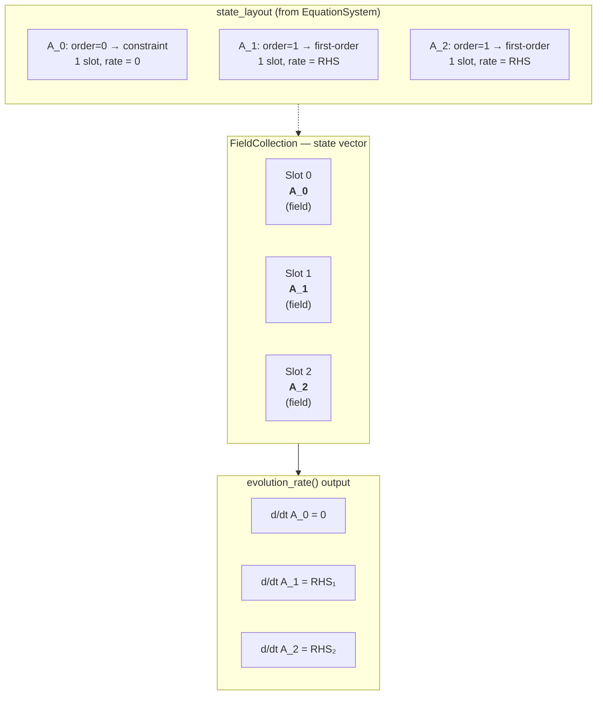
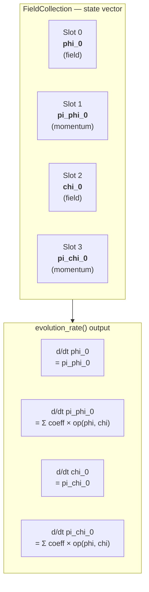
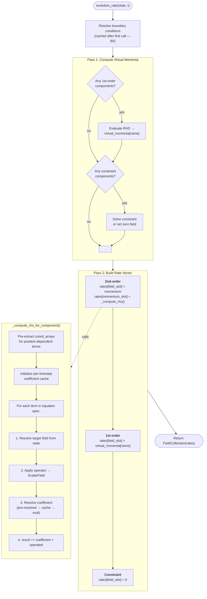

# Architecture

Visual guide to the TIDAL Lagrangian-to-PDE pipeline.
All PDEs derive from a Lagrangian via symbolic computation — no physics is hardcoded in Python.

---

## 1. Data Flow Pipeline

The pipeline has two stages separated by a JSON specification file.

**Stage 1 (Mathematica/xAct)** derives field equations symbolically from a Lagrangian.
**Stage 2 (Python/py-pde)** loads the specification and runs a numerical simulation.

```mermaid
flowchart LR
    subgraph stage1["Stage 1 — Symbolic (Mathematica / xAct)"]
        L["Lagrangian<br/>L(φ, ∂φ, g)"] --> EL["EulerLagrange.wl<br/>δL/δφ = 0"]
        EL --> CD["ComponentDecompose.wl<br/>Tensor → scalar components"]
        CD --> EJ["ExportJSON.wl<br/>BuildMultiFieldJSONStructure"]
    end

    EJ --> JSON[("JSON Specification<br/>examples/data/*.json")]

    subgraph stage2["Stage 2 — Numerical (Python / py-pde)"]
        JSON --> JL["json_loader.py<br/>load_equation_system()"]
        JL --> ES["EquationSystem<br/>(frozen dataclass)"]
        ES --> PB["pde_builder.py<br/>PDEFromSpec(PDEBase)"]
        PB --> SOLVE["py-pde solver<br/>(scipy RK45)"]
        SOLVE --> OUT["Simulation results<br/>& plots"]
    end
```



### Wolfram Module Roles

| Module | Purpose | Key Export |
|--------|---------|-----------|
| `CommonUtilities.wl` | Shared helpers: CD→Derivative conversion, Christoffel/epsilon evaluation, metric components | `ConvertCDToDerivatives`, `EvaluateChristoffelComponents` |
| `EulerLagrange.wl` | Derive equations of motion from a Lagrangian | `EulerLagrangeEquation[L, field, cd]` |
| `ComponentDecompose.wl` | Convert tensor EOM to scalar component equations | `DecomposeToComponents[eom, field, chart, additionalFields]` |
| `ExportJSON.wl` | Serialize component equations to JSON | `BuildMultiFieldJSONStructure[fieldEquations, metadata]` |
| `Linearize.wl` | Perturbation theory (xPert) for linearized gravity | `LinearizeTensorExpression[expr]` |

### JSON Specification Structure

```
{
  "spacetime": { dimension, signature, coordinates },
  "fields":    [{ name, index, is_dynamical }],
  "equations": [{
    field_name,
    lhs: { expression, order: { time: N } },
    rhs: [{ coefficient, coefficient_symbolic, operator, field,
             time_dependent, coordinate_dependent }]
  }],
  "coupling":  { mass_matrix, coupling_matrix },
  "metadata":  { lagrangian, gauge, linearized, ... }
}
```

---

## 2. Python Module Dependencies



The `symbolic/` subpackage is the core pipeline — it loads JSON specs and builds PDE solvers.
The `cli/` subpackage provides the `tidal` command-line interface (derive, simulate, inspect, measure, list, validate).
The `measurement/` subpackage provides post-hoc analysis tools (energy, conversion, spectra, mixing).

---

## 3. State Structure (FieldCollection Layout)

The simulation state is a `FieldCollection` — a flat list of `ScalarField` objects.
The layout depends on each component's **time derivative order** in the JSON specification:

| Time Order | Slots Used | Rate Computation |
|-----------|------------|-----------------|
| 2 (wave-like) | field + momentum | d/dt field = momentum; d/dt momentum = RHS |
| 1 (first-order) | field only | d/dt field = RHS (via virtual momentum) |
| 0 (constraint) | field only | d/dt field = 0 (solved algebraically) |

### Example: Chern-Simons (A_0 constraint, A_1 and A_2 first-order)



### Example: Coupled Scalars (two second-order fields)



Cross-field coupling: a term in the phi equation can reference `chi_0` via `{"operator": "laplacian", "field": "chi_0"}`.

---

## 4. Execution Flow: `evolution_rate()`

Called by the ODE solver at every timestep. Uses a two-pass algorithm to handle mixed time orders.



### Coefficient Resolution Hierarchy

Each RHS term has a coefficient that may be constant, time-dependent, or position-dependent.
Resolution follows a fast-path hierarchy:

```
1. Pre-resolved (B4)     — constant coefficients computed once at __init__
2. Per-timestep cache (C1) — deduplicates eval() for shared symbolic expressions
3. Full evaluation         — _resolve_coefficient_at_point(term, t, grid, coord_arrays)
     ├─ Constant: simple parameter lookup → float
     ├─ Time-only: eval(expr, {t=t, params}) → float
     └─ Position-dependent: eval(expr, {t, x, y, z}) → ndarray (grid-shaped)
```

---

## Working Examples

| Example | Dim | Fields | Key Features |
|---------|-----|--------|--------------|
| `scalar_field/` | 1+1D | phi_0 | Basic scalar wave, mass term |
| `electromagnetic/` | 1+1D | A_0, A_1 | Vector field, Lorenz gauge |
| `coupled_scalars/` | 1+1D | phi_0, chi_0 | Cross-field coupling, mass matrix |
| `chern_simons/` | 2+1D | A_0, A_1, A_2 | Epsilon tensor, constraint equation |
| `elasticity/` | 2+1D | u_0, u_1 | Anisotropic Laplacian, cross derivatives |
| `curved_spacetime/` | 2+1D | phi_0 | De Sitter Hubble friction, time-dependent coefficients |
| `sphere_kg/` | 2+1D | phi_0 | Stereographic S2, position-dependent coefficients |
| `polar_kg/` | 2+1D | phi_0 | Polar coordinates, 1/r Christoffel correction |
| `spherical_kg/` | 3+1D | phi_0 | Spherical coordinates, trig coefficients (Cot, Csc) |
| `cylindrical_kg/` | 3+1D | phi_0 | Mixed curved (r,theta) and flat (z) directions |
| `gravitational_waves/` | 3+1D | h_ij | xPert linearization, TT gauge, rank-2 tensor |

---

## Supported Operators

Operators map JSON terms to py-pde field operations. All support cross-field references.

| Operator | Min Dim | Description |
|----------|---------|-------------|
| `identity` | 1D | Field itself (mass terms) |
| `laplacian` | 1D | Full spatial Laplacian |
| `laplacian_x`, `_y`, `_z` | 1D/2D/3D | Directional second derivative |
| `gradient_x`, `_y`, `_z` | 1D/2D/3D | Directional first derivative |
| `cross_derivative_xy`, `_xz`, `_yz` | 2D/3D | Mixed partial derivative |
| `first_derivative_t` | 1D | Time derivative (friction terms) |
| `biharmonic` | 1D | Fourth-order Laplacian |
| `derivative_N_x` | 1D | Nth-order derivative along axis |
